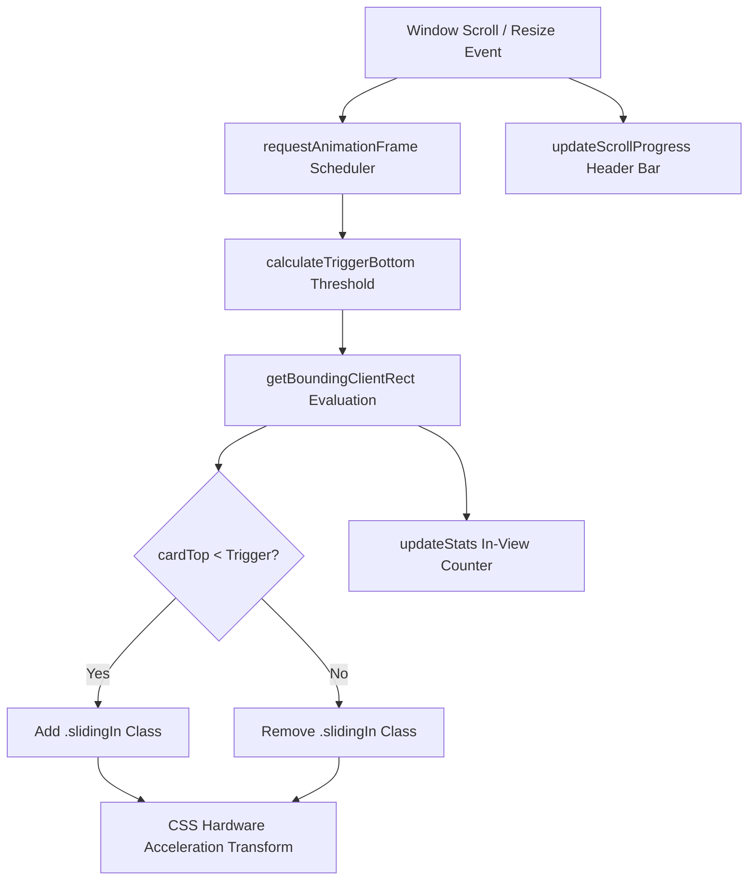

# Scroll Images Studio - Viewport Intersection Motion Engine

[](https://developer.mozilla.org/en-US/docs/Web/HTML)
[](https://developer.mozilla.org/en-US/docs/Web/CSS)
[](https://developer.mozilla.org/en-US/docs/Web/JavaScript)
[](https://nodejs.org/)
[](https://opensource.org/licenses/MIT)

A modern, high-performance scroll animation engine for web experiences. Features hardware-accelerated transforms, dynamic viewport boundary detection, multiple transition styles, and real-time scroll telemetry without external dependencies.

---

## Overview

Scroll Images Studio orchestrates smooth visual storytelling as users navigate down a webpage. By monitoring bounding client rect coordinates via requestAnimationFrame scheduling, elements smoothly slide, rotate, and scale into view upon entering a defined viewport trigger threshold.

---

## Key Features

- **Hardware-Accelerated Physics**: Uses CSS `transform` and `opacity` with cubic-bezier easing to ensure 60fps rendering without layout recalculations.
- **Immediate Initial Hydration**: Automatically triggers on DOMContentLoaded to guarantee above-the-fold content is instantly visible without requiring initial scroll input.
- **Dual Animation Presets**: Switch dynamically between alternating horizontal slide-ins and vertical 3D depth zooms.
- **Scroll Progress Telemetry**: Real-time reading progress bar pinned to the top of the viewport.
- **Live In-View Counter**: Displays dynamic counts of visible versus offscreen elements in real time.
- **Smooth Scroll Controls**: One-click floating action button to return smoothly to the top of the gallery.
- **Fully Responsive Architecture**: Adapts card dimensions, padding, and translation distances across mobile, tablet, and desktop screens.
- **Zero External Dependencies**: Engineered with pure semantic HTML5, modern CSS3 variables, and vanilla ECMAScript.

---

## Architecture & Data Flow



---

## Project Structure

```text
Scrolling-Images-Effect/
├── .gitignore             
├── index.html              
├── README.md                
├── script.js              
├── style.css              
└── tests/
    └── test_scroll_engine.js 
```

---

## Getting Started

### Prerequisites

- Any modern web browser (Google Chrome, Mozilla Firefox, Microsoft Edge, Apple Safari)
- Optional: Node.js (version 16 or newer) for executing the automated unit test suite

### Running the Application

1. Clone the repository:

```bash
git clone https://github.com/Kumar44developer/Scrolling-Images-Effect.git
cd Scrolling-Images-Effect
```

2. Open the application directly in your browser:

Launch the file via system default browser:

```bash
start index.html
```

Or serve via an HTTP server:

```bash
npx serve .
```

---

## Automated Testing

The project includes an automated unit test suite validating threshold mathematics, intersection detection boundaries, alternating slide trajectories, and batch visibility accounting.

Run the test suite using Node.js:

```bash
node tests/test_scroll_engine.js
```

Expected output:

```text
Running Scroll Images Effect Unit Tests...

PASS: Viewport trigger threshold calculated with precision
PASS: Card visibility boundaries evaluate accurately
PASS: Odd and even cards alternate slide-in trajectories
PASS: Batch visibility accounting accurately tracks active DOM cards

All 4 Scroll Effect unit test suites passed successfully!
```

---

## Technical Specifications

| Component | Technology | Specification |
| :--- | :--- | :--- |
| Markup | HTML5 | Accessible container structure, semantic headings |
| Styling | CSS3 | Flexbox, CSS variables, cubic-bezier transforms |
| Typography | Google Fonts | Outfit (headings) and Plus Jakarta Sans (body) |
| Runtime Logic | JavaScript (ES6+) | requestAnimationFrame throttling, DOM event listeners |
| Testing Harness | Node.js | Native assertion engine |

---

## Browser Support

- Google Chrome: Version 88+
- Mozilla Firefox: Version 85+
- Microsoft Edge: Version 88+
- Apple Safari: Version 14+
- Mobile Browsers: iOS Safari & Chrome for Android

---

## License

This project is licensed under the MIT License. Open source and available for personal and commercial use.
